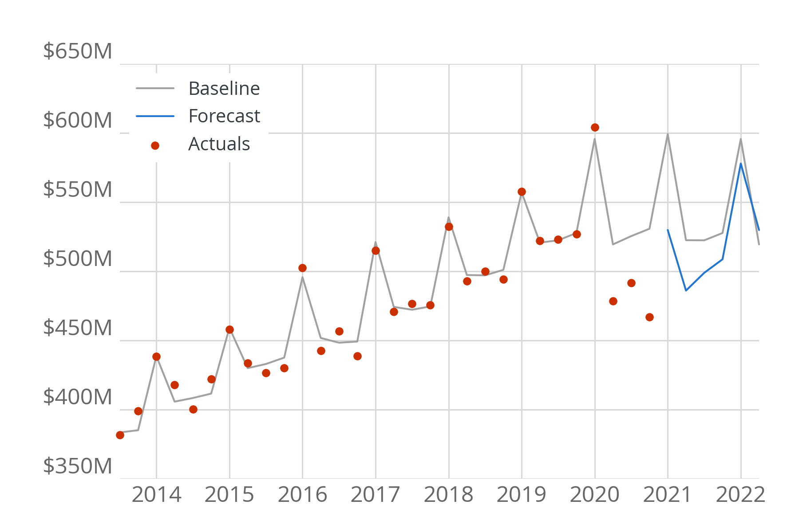
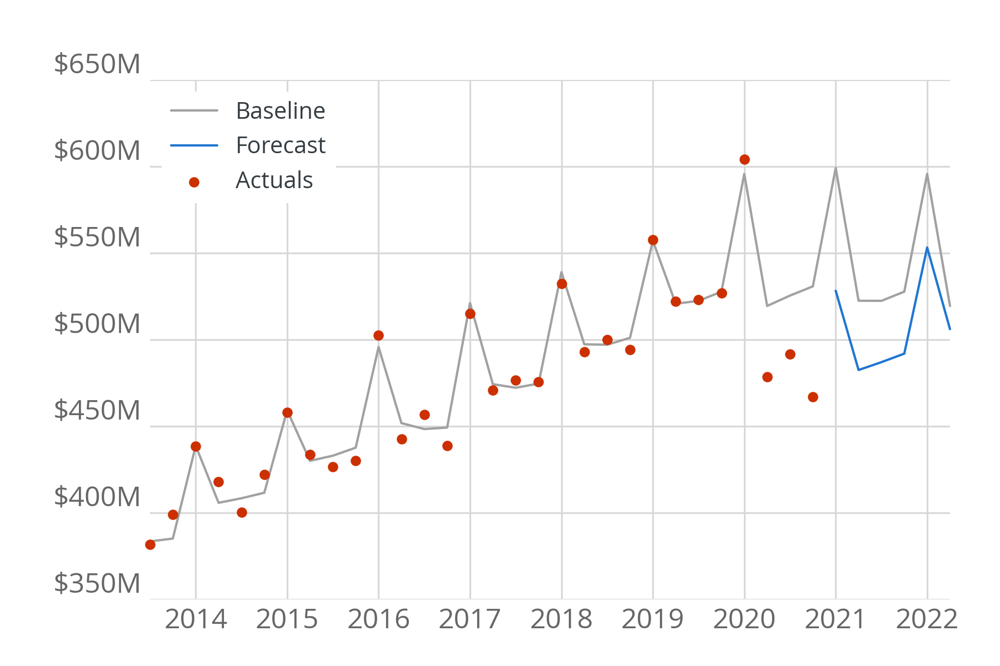

# covid19-forecaster

Analysis toolkit for forecasting the revenue impact of COVID-19 on the City of Philadelphia's finances.

Read the reports:

- ["Analysis of the Continued Impact of COVID-19 on the City of Philadelphia’s Tax Revenues" (March 2021)](https://controller.phila.gov/philadelphia-audits/covid19-fiscal-impact-mar-2021/)
- ["Estimates of the Impact of COVID-19 on the City of Philadelphia’s Tax Revenues" (April 2020)](https://controller.phila.gov/philadelphia-audits/covid19-fiscal-impact/)


## Installation

The following commands should be run from the command line, e.g., the Terminal app on 
MacOS or Command Prompt on Windows.

### Step 1: Make sure you have the [poetry](https://python-poetry.org/docs) tool installed. 

Installation instructions are available on the [poetry documentation](https://python-poetry.org/docs/#installation).

### Step 2: Clone the repository

From the command line:

```bash
# Clone the repository
git clone https://github.com/PhiladelphiaController/covid19-forecaster.git

# Change to the new folder
cd covid19-forecaster
```

### Step 3: Install the dependencies

We will `poetry` to install the necessary dependencies into their own virtual environment. 

From the `covid19-forecaster` folder, run:

```bash
poetry install
```

This will install all dependencies (as well as the development dependencies).

## Running the forecasts

From the command line, the **March 2021** forecast can be run using the following command:

```bash
poetry run covid19-forecaster results/
```

This will save data from the forecast to the `results/` folder. 

### Working in an interactive environment

You can run the software in an interactive environment using [Jupyter lab](https://jupyterlab.readthedocs.io/en/stable/) by running:

```bash
poetry run jupyter lab
```

This *should* launch a Jupyter window on your browser, at which point you can create a new notebook file (`.ipynb` file).

To run the software from the notebook, first import the March 2021 model (denoted as "v2"). From within a cell, run:

```python
# Import the March 2021 version of the forecast (v2)
from covid19_forecaster.v2 import *
```

Now, you can examine the forecasts for individual taxes. For example, for the Wage Tax model:


```python
# Load the wage tax model
wage = WageTaxForecast()
```
Examine the 'moderate' scenario:

```python
wage.run_forecast("moderate")
wage.plot()
```


Examine the 'severe' scenario:

```python
wage.run_forecast("severe")
wage.plot()
```




